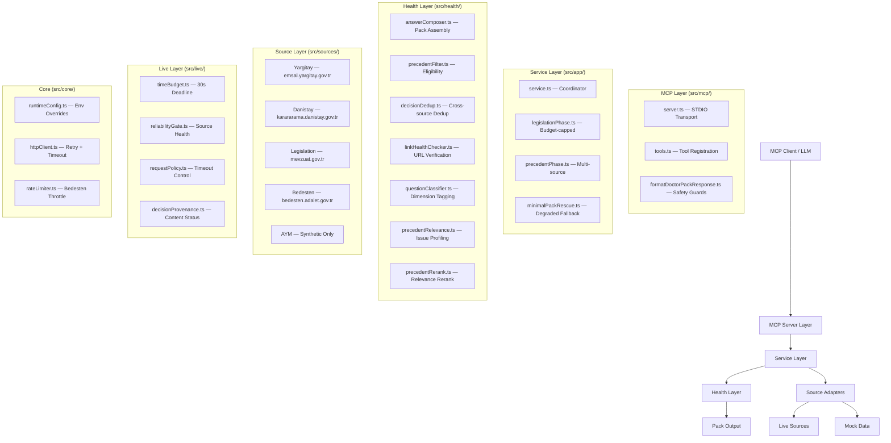
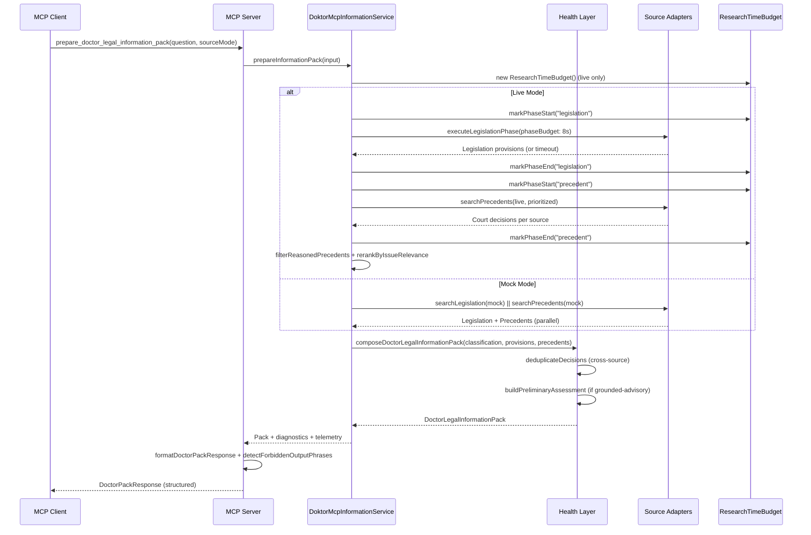

# doktor-mcp Architecture

## Overview

doktor-mcp is a Model Context Protocol (MCP) server that provides source-grounded legal
information packs for physicians. It searches official Turkish legislation and high court
decisions, assembling them into structured packs with safety guards.

## Layer Diagram



## Data Flow



## Mock vs Live Mode

| Aspect | Mock Mode | Live Mode |
|--------|-----------|-----------|
| Legislation | Static `MockLegislationAdapter` | `LiveOfficialLegislationAdapter` → mevzuat.gov.tr |
| Precedents | Static `MockYargitayAdapter`, `MockDanistayAdapter`, `MockAymAdapter` | `LiveYargitayAdapter`, `LiveDanistayAdapter`, `LiveBedestenAdapter` |
| AYM | Mock data only | Synthetic only (not reachable via API) |
| Time Budget | None — parallel, unlimited | 30s deadline, 8s legislation / 15s precedent phase caps |
| Network | None | Real HTTP calls with retry + rate limiting |
| Telemetry | Empty `queryTelemetry` | Full per-query telemetry (cache hit/miss, retry, timeout) |
| Fallback on failure | N/A | Minimal pack rescue (partial data from completed phases) |
| Precedent dedup | Cross-source dedup same as live | Cross-source dedup (Yargitay + Bedesten overlap) |

## Security Gates

### 1. Forbidden Output Phrases — `src/mcp/formatDoctorPackResponse.ts`

Hard-blocked phrases that **must not** appear in pack output. These are categorical
judgments that cross into legal advice territory:

- `kesin olarak sorumlusunuz`, `kesin beraat eder`, `derhal şunu yapın`
- `savunma dilekçesi şöyle olmalı`, `şu cezayı alırsınız`, `şunu yapmanız gerekir`
- `kesin hukuki kanaat`, `dilekçe taslağı`, `savunma taslağı`, `derhal yapılacak`

**Allowed** (since v0.44.0): conditional assessments like `risk seviyesi yüksek` — these
express source-grounded evaluation, not categorical judgment.

### 2. Pack Audit — `src/packAudit.ts`

Comprehensive audit that validates:

- **MVP-out-of-scope fields** — `riskLevel`, `immediateActions`, `finalLegalOpinion` etc.
- **Legislation metadata** — `inForce` status, `repealed` flag, `sourceDocumentId` presence
- **Precedent field completeness** — court, date, fact summary, legal assessment, outcome
- **Unofficial source detection** — mock accessSource in live packs, non-.gov.tr URLs
- **Forbidden phrase scanning** — 22+ phrases across all free-text fields
- **Contract compliance** — required sections (shortAnswer, legalClassification, etc.)

### 3. Response Format — `src/mcp/formatDoctorPackResponse.ts`

`DoctorPackResponse` wraps the raw pack with:

- `status`: `full_pack` | `partial_pack` | `no_pack_diagnostic`
- `summary`: source sufficiency, counts, timeout indicators
- `diagnostics`: coverage gaps, missing authority types, gate observations
- `_forbiddenPhraseWarning`: array of detected forbidden phrases (non-blocking warning)

### 4. Safety Invariants — `tests/safetyInvariants.test.ts`

Fast mock-mode checks that verify:

1. KVKK private data must not appear in non-privacy packs
2. Live mode must not silently fall back to mock data
3. Hard-blocked phrases must not appear in output
4. General medical questions must not contain privacy-law content
5. `shortAnswer` must never be empty
6. Forbidden field names (`riskLevel`, `immediateActions`, etc.) must be absent
7. `preliminaryAssessment` must not contain categorical judgment language
8. Strict mode must not produce `preliminaryAssessment`

## Time Budget Flow

Live mode enforces a strict time budget to prevent runaway research. Configuration
lives in `src/core/runtimeConfig.ts` with env overrides via `DOKTOR_MCP_*` variables.

```
Total Budget: 30,000 ms
Reserve:       3,000 ms (for pack assembly)
Usable:       27,000 ms

┌─────────────────────────────────────────────────────────────────┐
│                                                                 │
│  Legislation Phase              Precedent Phase       Reserve   │
│  Budget: 8,000 ms (hard cap)   Budget: 15,000 ms     3,000 ms │
│  ┌──────────────────┐          ┌──────────────────┐            │
│  │ Promise.race     │          │ Per-source        │            │
│  │ search + timeout │          │ parallel search   │            │
│  │                  │          │                   │            │
│  │ On timeout:      │          │ Yargitay (1st)    │            │
│  │ → unavailable    │          │ Danistay (2nd)    │            │
│  │ → proceed to     │          │ Bedesten (if set) │            │
│  │   precedent      │          │                   │            │
│  └──────────────────┘          └──────────────────┘            │
│           │                            │                        │
│           └──────── Budget exhausted ───┘                        │
│                          │                                      │
│                  Minimal Pack Rescue                            │
│                  (partial legislation only)                     │
└─────────────────────────────────────────────────────────────────┘
```

**Key behaviors:**
- Legislation phase uses `Promise.race` with a timeout — if it exceeds the budget,
  the phase is marked `timedOut` but precedent search still proceeds
- Precedent phase runs sources in parallel; if budget exhausts mid-search, partial
  results are retained via `MinimalPackRescueManager`
- `effectivePhaseBudgetMs()` caps each phase to `min(phaseBudget, remainingMs)`
- Phase won't start if effective budget < 500ms (`shouldStartPhase()`)

## Source Adapters

| Source | Adapter | Search | Full Text | Rate Limit | Calibration |
|--------|---------|--------|-----------|------------|-------------|
| mevzuat.gov.tr | `LiveOfficialLegislationAdapter` | Yes | Yes | 30 req/min | stable |
| emsal.yargitay.gov.tr | `LiveYargitayAdapter` (via Bedesten) | Yes | Yes | 30 req/min, 60s cooldown | via_bedesten |
| karararama.danistay.gov.tr | `LiveDanistayAdapter` | Yes | Yes | 20 req/min, 30s cooldown | stable |
| bedesten.adalet.gov.tr | `LiveBedestenAdapter` | Yes | Yes | 30 req/min, 60s cooldown | stable |
| AYM | `MockAymAdapter` only | No | No | N/A | synthetic_only |

Source capabilities are registered in `src/sources/sourceRegistry.ts` for tooling and
MCP capability reporting. Adapters do NOT branch on the registry — it is informational.

## Key Files

| File | Purpose | Lines |
|------|---------|-------|
| `src/mcp/server.ts` | MCP STDIO server, resources, prompts | 87 |
| `src/mcp/tools.ts` | Tool registration and handlers | 136 |
| `src/mcp/formatDoctorPackResponse.ts` | Safety guards, response formatting | 205 |
| `src/app/service.ts` | Service coordinator (live + mock paths) | 403 |
| `src/app/legislationPhase.ts` | Budget-capped legislation executor | 162 |
| `src/app/precedentPhase.ts` | Multi-source precedent orchestrator | 252 |
| `src/app/minimalPackRescue.ts` | Partial state rescue on timeout | 121 |
| `src/health/answerComposer.ts` | Pack assembly + preliminary assessment | 222 |
| `src/health/precedentFilter.ts` | Precedent eligibility + diagnostics | 108 |
| `src/health/decisionDedup.ts` | Cross-source decision deduplication | 74 |
| `src/health/linkHealthChecker.ts` | URL reachability verification | 174 |
| `src/health/precedentRelevance.ts` | Issue profile + relevance scoring | 175 |
| `src/health/precedentRerank.ts` | Relevance-based reranking | 69 |
| `src/sources/yargitay/liveYargitayAdapter.ts` | Live Yargitay adapter (Bedesten) | 303 |
| `src/live/timeBudget.ts` | Research time budget (30s deadline) | 112 |
| `src/packAudit.ts` | Comprehensive pack compliance audit | 489 |
| `src/core/runtimeConfig.ts` | Config schema + env overrides | 179 |
| `src/core/httpClient.ts` | HTTP client with retry + timeout | 273 |
| `src/benchmark/benchmarkRunner.ts` | Benchmark runner (mock + live) | 899 |
| `tests/safetyInvariants.test.ts` | Safety invariant checks | 111 |

## Testing

- **Unit tests**: `tests/*.test.ts` — across 55+ files
- **Coverage**: `npm run test:coverage` (v8 provider, HTML + text-summary)
- **Benchmark**: `npm run benchmark:doctor-questions` (mock) / `npm run benchmark:doctor-questions:live`
- **Safety invariants**: `tests/safetyInvariants.test.ts` — fast mock-mode safety checks
- **Pack audit**: `npm run pack:audit` — validates pack compliance against MVP constraints
