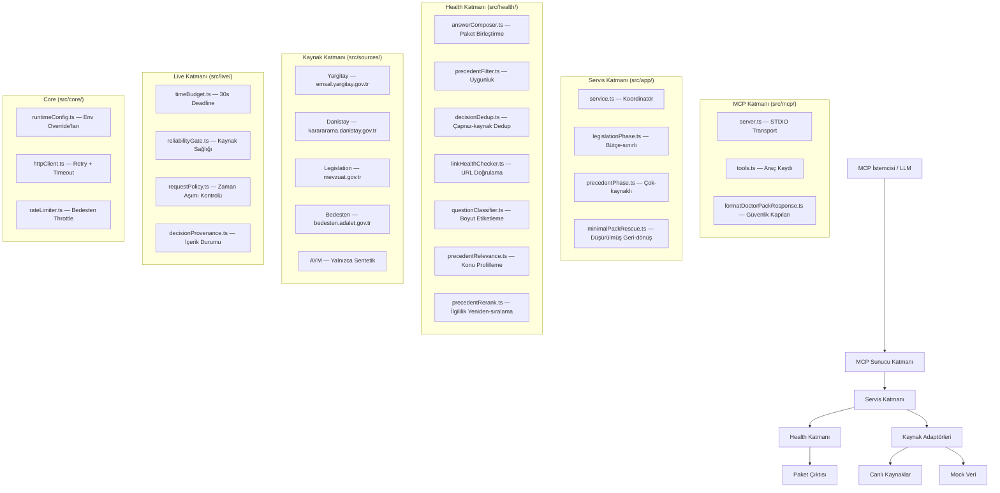
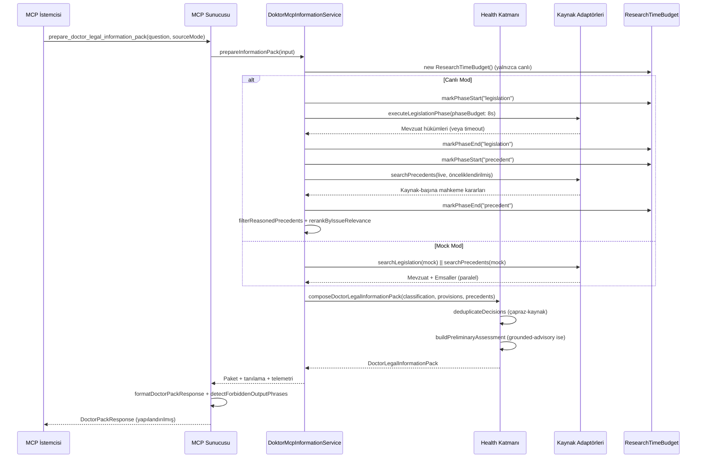

# doktor-mcp Mimarisi

## Genel Bakış

doktor-mcp, hekimlere kaynak-temelli hukuki bilgilendirme paketleri sağlayan bir Model
Context Protocol (MCP) sunucusudur. Resmî Türk mevzuatını ve yüksek mahkeme kararlarını
arar, bunları güvenlik kapılarıyla yapılandırılmış paketler halinde birleştirir.

## Katman Diyagramı



## Veri Akışı



## Mock vs Canlı Mod

| Açı | Mock Mod | Canlı Mod |
|-----|----------|-----------|
| Mevzuat | Statik `MockLegislationAdapter` | `LiveOfficialLegislationAdapter` → mevzuat.gov.tr |
| Emsaller | Statik `MockYargitayAdapter`, `MockDanistayAdapter`, `MockAymAdapter` | `LiveYargitayAdapter`, `LiveDanistayAdapter`, `LiveBedestenAdapter` |
| AYM | Yalnızca mock veri | Yalnızca sentetik (API ile erişilemez) |
| Zaman Bütçesi | Yok — paralel, sınırsız | 30s deadline, 8s mevzuat / 15s emsal faz sınırları |
| Ağ | Yok | Retry + hız limiti ile gerçek HTTP çağrıları |
| Telemetri | Boş `queryTelemetry` | Tam sorgu-başına telemetri (cache hit/miss, retry, timeout) |
| Hatada geri-dönüş | Uygulanamaz | Minimal pack rescue (tamamlanmış fazlardan kısmi veri) |
| Emsal dedup | Canlıyla aynı çapraz-kaynak dedup | Çapraz-kaynak dedup (Yargitay + Bedesten örtüşmesi) |

## Güvenlik Kapıları

### 1. Yasak Çıktı İfadeleri — `src/mcp/formatDoctorPackResponse.ts`

Paket çıktısında **bulunmaması gereken** hard-blocked ifadeler. Bunlar hukuki tavsiye
alanına geçen kategorik hükümlerdir:

- `kesin olarak sorumlusunuz`, `kesin beraat eder`, `derhal şunu yapın`
- `savunma dilekçesi şöyle olmalı`, `şu cezayı alırsınız`, `şunu yapmanız gerekir`
- `kesin hukuki kanaat`, `dilekçe taslağı`, `savunma taslağı`, `derhal yapılacak`

**İzinli** (v0.44.0'dan beri): `risk seviyesi yüksek` gibi koşullu değerlendirmeler — bunlar
kategorik hüküm değil, kaynağa dayalı değerlendirme ifade eder.

### 2. Pack Audit — `src/packAudit.ts`

Şunları doğrulayan kapsamlı denetim:

- **MVP-kapsam-dışı alanlar** — `riskLevel`, `immediateActions`, `finalLegalOpinion` vb.
- **Mevzuat meta verisi** — `inForce` durumu, `repealed` bayrağı, `sourceDocumentId` varlığı
- **Emsal alan eksiksizliği** — mahkeme, tarih, olay özeti, hukuki değerlendirme, sonuç
- **Resmî-olmayan kaynak tespiti** — canlı paketlerde mock accessSource, .gov.tr-olmayan URL'ler
- **Yasak ifade taraması** — tüm serbest-metin alanlarında 22+ ifade
- **Sözleşme uyumu** — gerekli bölümler (shortAnswer, legalClassification, vb.)

### 3. Yanıt Formatı — `src/mcp/formatDoctorPackResponse.ts`

`DoctorPackResponse`, ham paketi şunlarla sarar:

- `status`: `full_pack` | `partial_pack` | `no_pack_diagnostic`
- `summary`: kaynak yeterliliği, sayılar, timeout göstergeleri
- `diagnostics`: kapsama boşlukları, eksik otorite tipleri, kapı gözlemleri
- `_forbiddenPhraseWarning`: tespit edilen yasak ifadeler dizisi (bloke etmeyen uyarı)

### 4. Güvenlik İnvariyantları — `tests/safetyInvariants.test.ts`

Şunları doğrulayan hızlı mock-mod kontrolleri:

1. KVKK özel verisi mahremiyet-olmayan paketlerde bulunmamalı
2. Canlı mod sessizce mock veriye geri dönmemeli
3. Hard-blocked ifadeler çıktıda bulunmamalı
4. Genel tıbbi sorular mahremiyet-hukuku içeriği barındırmamalı
5. `shortAnswer` asla boş olmamalı
6. Yasak alan adları (`riskLevel`, `immediateActions`, vb.) bulunmamalı
7. `preliminaryAssessment` kategorik hüküm dili içermemeli
8. Strict mod `preliminaryAssessment` üretmemeli

## Zaman Bütçesi Akışı

Canlı mod, kontrolsüz araştırmayı önlemek için katı bir zaman bütçesi uygular. Yapılandırma
`src/core/runtimeConfig.ts`'te yaşar; `DOKTOR_MCP_*` değişkenleriyle env override'ları yapılabilir.

```
Toplam Bütçe: 30,000 ms
Rezerv:        3,000 ms (paket birleştirme için)
Kullanılabilir: 27,000 ms

┌─────────────────────────────────────────────────────────────────┐
│                                                                 │
│  Mevzuat Fazı                   Emsal Fazı            Rezerv     │
│  Bütçe: 8,000 ms (sert sınır)   Bütçe: 15,000 ms     3,000 ms  │
│  ┌──────────────────┐          ┌──────────────────┐            │
│  │ Promise.race     │          │ Kaynak-başına     │            │
│  │ arama + timeout  │          │ paralel arama     │            │
│  │                  │          │                   │            │
│  │ Timeout'ta:      │          │ Yargitay (1.)     │            │
│  │ → unavailable    │          │ Danistay (2.)     │            │
│  │ → emsal fazına   │          │ Bedesten (ayarlıysa)│          │
│  │   geç            │          │                   │            │
│  └──────────────────┘          └──────────────────┘            │
│           │                            │                        │
│           └──────── Bütçe tükendi ─────┘                        │
│                          │                                      │
│                  Minimal Pack Rescue                            │
│                  (yalnızca kısmi mevzuat)                       │
└─────────────────────────────────────────────────────────────────┘
```

**Temel davranışlar:**
- Mevzuat fazı bir timeout ile `Promise.race` kullanır — bütçeyi aşarsa faz `timedOut`
  işaretlenir ama emsal araması yine de devam eder
- Emsal fazı kaynakları paralel çalıştırır; bütçe arama ortasında tükenirse kısmi sonuçlar
  `MinimalPackRescueManager` aracılığıyla korunur
- `effectivePhaseBudgetMs()` her fazı `min(phaseBudget, remainingMs)` ile sınırlar
- Etkin bütçe < 500ms ise faz başlamaz (`shouldStartPhase()`)

## Kaynak Adaptörleri

| Kaynak | Adaptör | Arama | Tam Metin | Hız Limiti | Kalibrasyon |
|--------|---------|-------|-----------|------------|-------------|
| mevzuat.gov.tr | `LiveOfficialLegislationAdapter` | Evet | Evet | 30 istek/dk | stable |
| emsal.yargitay.gov.tr | `LiveYargitayAdapter` (Bedesten üzerinden) | Evet | Evet | 30 istek/dk, 60s soğuma | via_bedesten |
| karararama.danistay.gov.tr | `LiveDanistayAdapter` | Evet | Evet | 20 istek/dk, 30s soğuma | stable |
| bedesten.adalet.gov.tr | `LiveBedestenAdapter` | Evet | Evet | 30 istek/dk, 60s soğuma | stable |
| AYM | Yalnızca `MockAymAdapter` | Hayır | Hayır | Uygulanamaz | synthetic_only |

Kaynak yetenekleri, araç ve MCP yetenek raporlaması için `src/sources/sourceRegistry.ts`'te
kaydedilir. Adaptörler registry'ye göre dallanmaz — o yalnızca bilgilendiricidir.

## Anahtar Dosyalar

| Dosya | Amaç | Satır |
|-------|------|-------|
| `src/mcp/server.ts` | MCP STDIO sunucusu, resources, prompts | 87 |
| `src/mcp/tools.ts` | Araç kaydı ve işleyiciler | 136 |
| `src/mcp/formatDoctorPackResponse.ts` | Güvenlik kapıları, yanıt formatlama | 205 |
| `src/app/service.ts` | Servis koordinatörü (canlı + mock yollar) | 403 |
| `src/app/legislationPhase.ts` | Bütçe-sınırlı mevzuat yürütücüsü | 162 |
| `src/app/precedentPhase.ts` | Çok-kaynaklı emsal orkestratörü | 252 |
| `src/app/minimalPackRescue.ts` | Timeout'ta kısmi durum kurtarma | 121 |
| `src/health/answerComposer.ts` | Paket birleştirme + ön değerlendirme | 222 |
| `src/health/precedentFilter.ts` | Emsal uygunluğu + tanılama | 108 |
| `src/health/decisionDedup.ts` | Çapraz-kaynak karar deduplikasyonu | 74 |
| `src/health/linkHealthChecker.ts` | URL erişilebilirlik doğrulaması | 174 |
| `src/health/precedentRelevance.ts` | Konu profili + ilgililik puanlaması | 175 |
| `src/health/precedentRerank.ts` | İlgililik-tabanlı yeniden sıralama | 69 |
| `src/sources/yargitay/liveYargitayAdapter.ts` | Canlı Yargitay adaptörü (Bedesten) | 303 |
| `src/live/timeBudget.ts` | Araştırma zaman bütçesi (30s deadline) | 112 |
| `src/packAudit.ts` | Kapsamlı paket uyum denetimi | 489 |
| `src/core/runtimeConfig.ts` | Config şeması + env override'ları | 179 |
| `src/core/httpClient.ts` | Retry + timeout ile HTTP istemcisi | 273 |
| `src/benchmark/benchmarkRunner.ts` | Benchmark runner (mock + canlı) | 899 |
| `tests/safetyInvariants.test.ts` | Güvenlik invariyant kontrolleri | 111 |

## Test

- **Birim testleri**: `tests/*.test.ts` — 55+ dosyada
- **Kapsam (coverage)**: `npm run test:coverage` (v8 sağlayıcı, HTML + text-summary)
- **Benchmark**: `npm run benchmark:doctor-questions` (mock) / `npm run benchmark:doctor-questions:live`
- **Güvenlik invariyantları**: `tests/safetyInvariants.test.ts` — hızlı mock-mod güvenlik kontrolleri
- **Pack audit**: `npm run pack:audit` — paketi MVP kısıtlarına karşı doğrular
